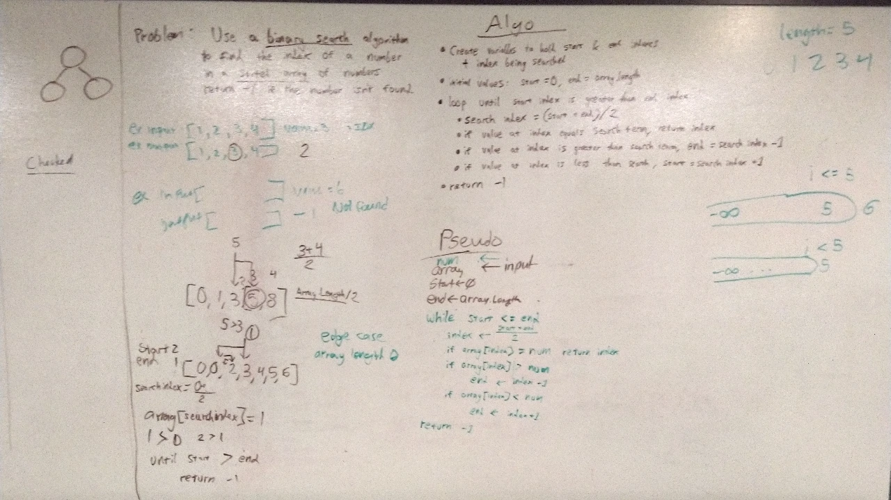

# Array Binary Search
A C# algorithm challenge implementation.

## Challenge
Create a method that performs a binary search on a sorted array of numbers. The method should return the index of the number in the array (or -1 if the number is not found).

## Approach & Efficiency
This search algorithm first checks the middle element in the array to see if its value matches the number being searched for. If the number being searched for is greater than the number at that index, the bottom end of the searchable region of the array is moved to be above the index that was searched. Likewise, if the number being searched for is less than the number at that index, the top end of the searchable region of the array is moved to be below the index that was searched. If the number at that index is equal the the number being searched for, the index is returned. This is repeated until the number is found or until there is nowhere else to look in the array.
### Big O
**Time**: O(log n)  
**Space**: O(1)

## Solution
