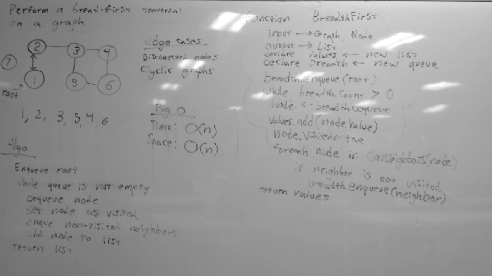

# Breadth First Graph Traversal
A C# algorithm challenge implementation.

## Challenge
Perform a breadth-first traversal on a graph.

## Approach & Efficiency
First, create a queue and a list, and enqueue the root node of the graph.
Next, dequeue from the queue, adding the node to the list of nodes. 
Mark the node as visited, and then enqueue each neighboring node (that hasn't already been visited).
Repeat the previous step until the queue is empty. Once the traversal has completed, the list of nodes is returned.

### Big O
- **Time**: O(n)
  - Because each node in the tree will need to be traversed, the amount of time taken to do so scales linearly with the size of the graph.
- **Space**: O(n)
  - The list of nodes generated by the traversal increases in size proportionally with the number of nodes in the graph.

## Solution
