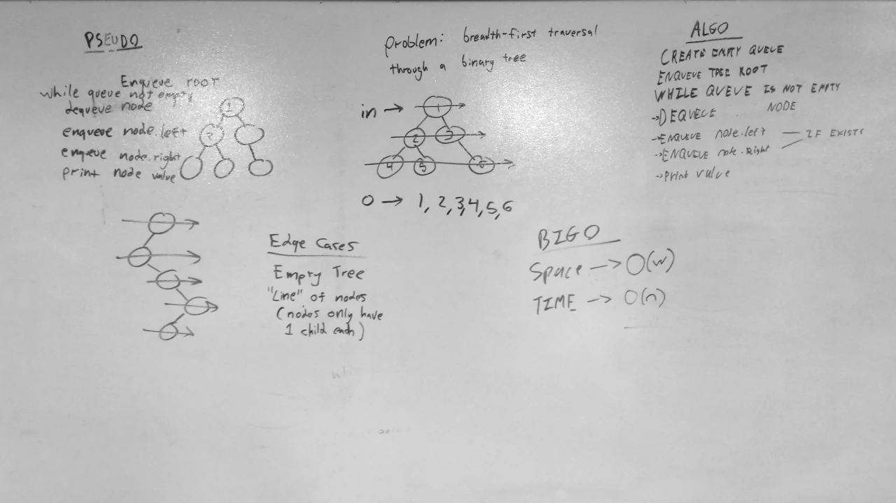

# Breadth First Traversal
A C# code challenge implementation.

## Challenge
Write a function that performs a breadth-first traversal of a binary tree. A breadth first traversal navigates through a tree layer by layer, going from left to right on each layer.

## Approach & Efficiency
This implementation uses a queue to perform the breadth-first traversal and uses a list to store all of the node values in the tree. At the start of the function, the tree's root is enqueued.
The queue is then dequeued from until the queue is empty. Everytime a node is dequeued, its value is added to the list and its left and right nodes are enqueued (if they exist).
Once the traversal has been completed, the list is returned.

### Big O
- **Time**: O(n)
  - This algorithm accesses each node once, therefore the time it takes to complete scales linearly with the number of nodes in the tree.
- **Space**: O(n)
  - This algorithm stores all of the tree's nodes in a list, and therefore the space taken by this list scales linearly with the number of nodes in the tree.

## Solution

