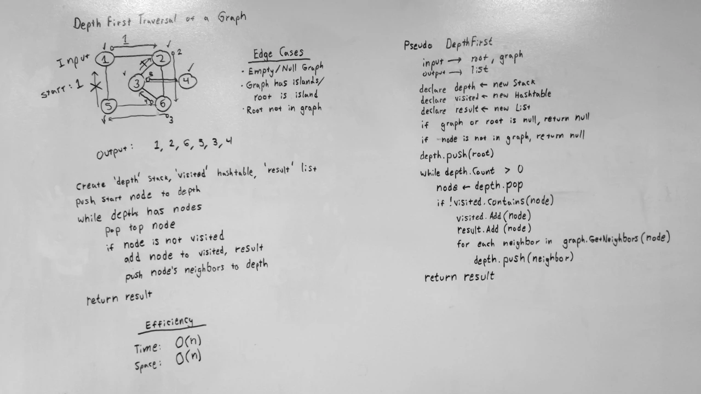

# Depth First Traversal of a Graph
A C# algorithm challenge implementation.

## Challenge
Perform a depth-first traversal on a graph.

## Approach & Efficiency
This solution uses a stack to perform the traversal.
First, the root node is pushed to the stack.
Next, a loop is started that continues until the stack is empty.
Each iteration, a node is popped from the stack and is checked if it has been visited.
If it hasn't, it is added to the dictionary of visited nodes and the output list.
Then, each of it's non-visited neighboring nodes are pushed to the stack.
Once the traversal has been completed, the list is returned.

### Big O
- **Time**: O(n2)
  - Worst case scenario: in a completed graph, every node will have to check each of its neighboring nodes if its been visited.
- **Space**: O(n2)
  - Worst case scenario: in a completed graph, every node that hasn't been visited will be added to the stack every iteration.

## Solution
