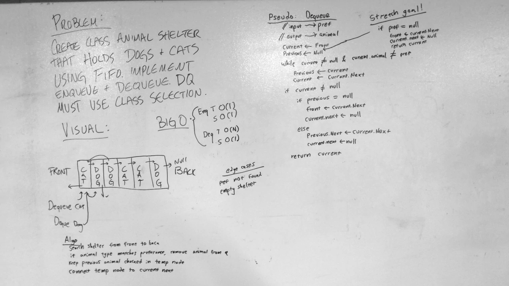

# FIFO Animal Shelter
A C# algorithm challenge implementation.

## Challenge
Create a AnimalShelter class that behaves like a queue and can take in both Cat and Dog objects (which inherit from an abstract Animal class).
When dequeueing from the AnimalShelter, an optional parameter can be given to specify whether to dequeue a Cat or a Dog (if no preference is given, the first animal is dequeued). 

## Approach & Efficiency
Enqueuing to the AnimalShelter works exactly like a regular queue. To learn more about how this works, [click here](../../data-structures/stack-and-queue).  
When dequeueing from the AnimalShelter:
- First, the AnimalShelter checks if the queue is empty. If it is, null is returned.
- Second, the AnimalShelter checks if no preference was given or if the first Animal in the queue matches the preference. If so, the front animal is dequeued from the list as normal.
- Third, the AnimalShelter checks if the preference given was either "cat" or "dog". If not, an exception is thrown.
- Next, the AnimalShelter iterates through the queue using two runner nodes (previous and current) until the end of the queue is reached or a matching animal is found.
- If a matching animal is found, previous.Next is set to current.Next and current.Next is set to null, removing current from the queue. Current is then returned.
- If no match is found, null is returned.

### Big O

#### Enqueue
**Time**: O(1)  
**Space**: O(1)

#### Dequeue
**Time**: O(n)  
**Space**: O(1)

## Solution
