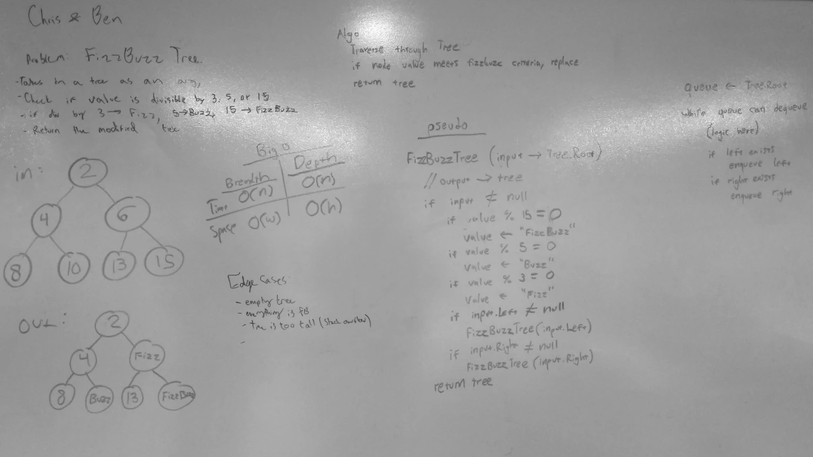

# FizzBuzzTree
A C# code challenge implementation.

## Challenge
Write a method that takes in a tree and performs FizzBuzz on it.

## Approach & Efficiency
- The method iterates through each node in the tree using a breadth-first approach.
- For each node, the node's value is checked. If the value is divisible by 3, the node's value is changed to "Fizz".
If the value is divisible by 5, the node's value is changed to "Buzz". If the value is divisible by both 3 and 5,
the value is changed to "FizzBuzz".
- After all nodes have been checked, the modified tree is returned.

## Solution
