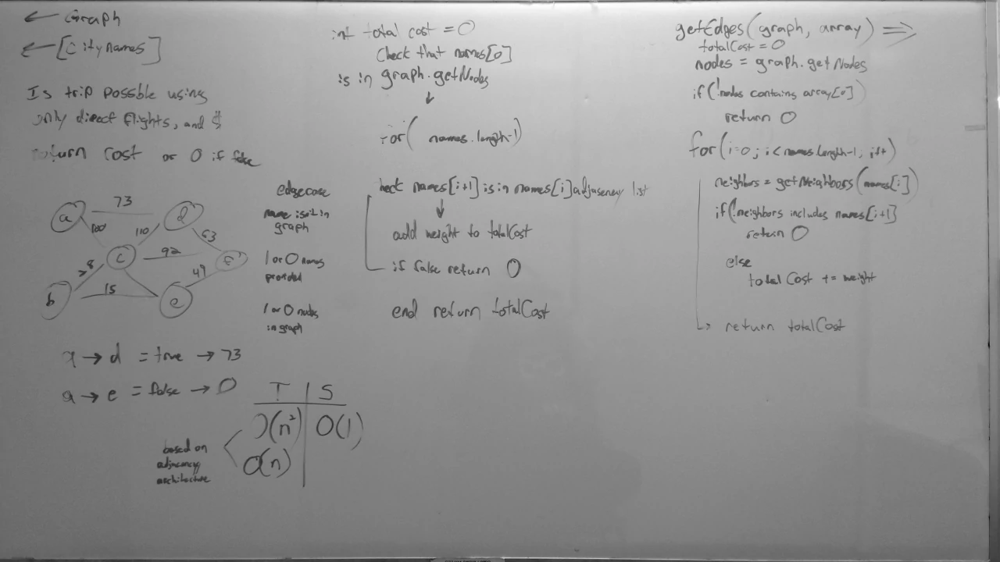

# Get Edges
A C# algorithm challenge implementation.

## Challenge
Given a business trip itinerary (as an array of city names), and an airline route map (as a graph),
determine if the trip is possible with direct flights, and if so, how much will the total trip cost?

## Approach & Implementation
First, if either the input array or graph contain less than two items, return zero (because a trip requires at least two locations).
Next, the itinerary is iterated through, checking if each location is connected to the next.
If the locations aren't connected, zero is returned because the trip isn't possible.
If the locations are connected, the cost to make that part of the trip is added to the total trip cost.
Once the last location in the itinerary is reached, the total cost is returned.

### Big O
- **Time**: O(n)
  - Because checking if each location is connected to the next and getting the cost of each flight has O(1) efficiency, the total amount of time taken by the algorithm scales linearly with the number of locations in the itinerary.
- **Space**: O(1)
  - No matter how large the input graph is or how large the itinerary is, the memory allocated by the algorithm remains constant.

## Solution

