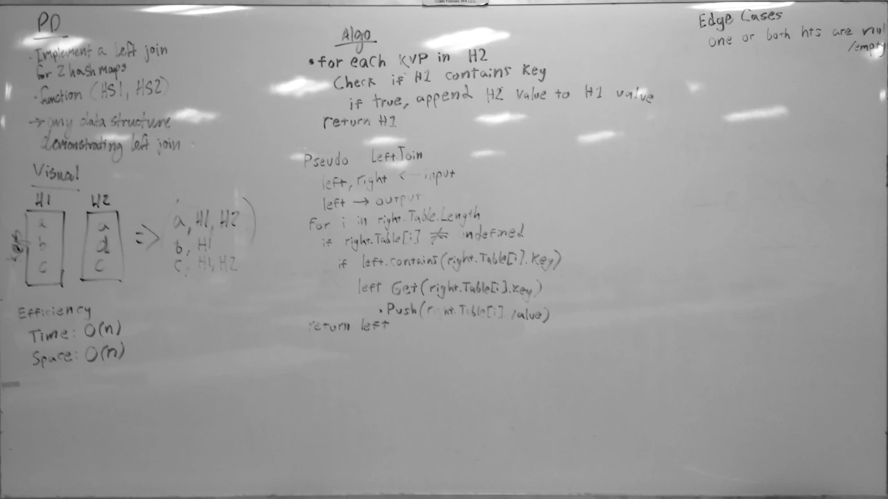

# Hashtable Left Join
A C# algorithm challenge implementation.

## Challenge
Write a function that takes in two hashtables as arguments, and performs a left join on them so that the 'left' table contains the values of matching keys in the 'right' table.

## Approach & Efficiency
This solution goes through the left table, checking each of its keys to see if a matching key exists in the right table.
If a match is found, the right table's value(s) for that key are added to the left table's list of values for that key.
After every key in the left table has been checked, the modified left table is returned.

### Big O
- **Time**: O(n)
  - This solution checks each key in the left table, and therefore the time it takes to complete scales linearly with the length of the left table.
- **Space**: O(n)
  - This solution copies values from the right table into the left table, creating new memory. The amount created scales linearly with the number of matching keys in the right table.

## Solution
