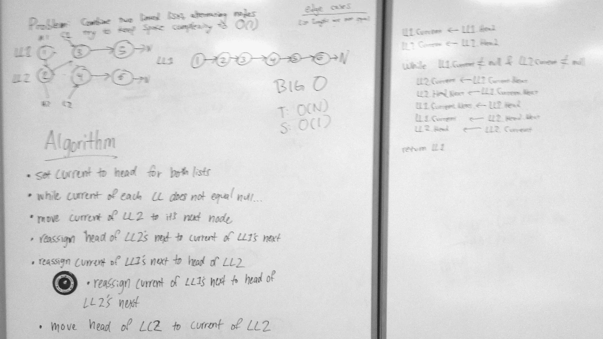

# Linked List Merge
A C# algorithm challenge implementation.

## Challenge
Write a method that takes in two linked lists as arguments and returns a linked list containing all of the nodes of both lists, zipped together.

## Approach & Efficiency
First, the method makes sure that the current node of each list is set back to the head.
Next, it begins iterating through both lists until the current of one of the lists is null. 

Each loop, the method manipulates the current of the first list and the current and head of list 2 such that by the end of each loop, list 2's head node is placed in between list 1's current and list 1's current's next node.
At the end of each loop, list 1's current is moved to the node after the node that was inserted, and list 2's head is moved to the next node in list 2.

This approach creates no new memory, but it destroys list 2 (unless list 1 is empty).
The length of time this method takes scales linearly with the length of the shortest list.

### Big O
**Time**: O(n)  
**Space**: O(1)

## Solution
