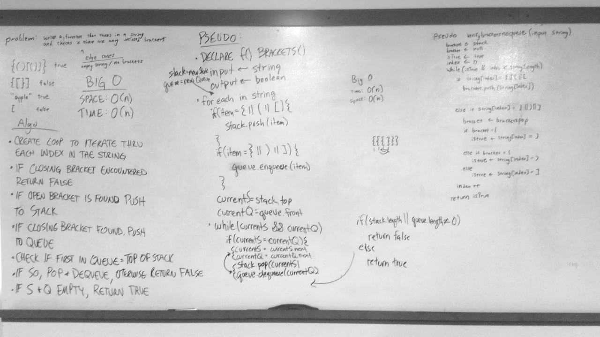

# Multi Bracket Validation
A C# algorithm challenge implementation.

## Challenge
Write a method that takes in a string and checks if the string has any unclosed brackets in it.

## Approach & Efficiency
1. First, create a new stack and begin iterating through each character in the string..
3. If the character is an opening bracket ("(", "[", or "{"), push the character to the stack.
4. If the character is a closing bracket ("}", "]", or, ")"), pop from the stack. If the stack cannot be popped from, or the current character does not match the style of bracket that was popped, return false.
4. After iterating through the string, check if any opening brackets remain in the stack. If so, return false. Otherwise, return true.
### Big O
**Time** O(n)
**Space** O(n)

## Solution
