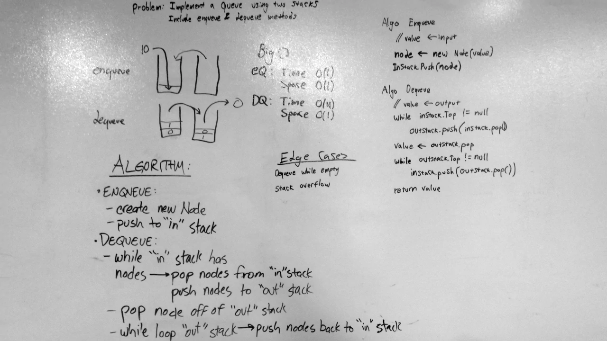

# Queue With Stacks
A C# algorithm challenge implementation.

## Challenge
Create a class that mimics the functionality of a queue by using two stacks.
The class should include methods to Enqueue and Dequeue nodes.

## Approach & Efficiency
When enqueueing, we must first make sure that all nodes in the "out" stack (if any) are popped out of the "out" stack and pushed into the "in" stack. Then, the node being queued will be pushed into the "in" stack.

The process for dequeueing works much the same way, pushing all nodes popped from the "in" stack into the "out" stack, and then popping from the "out" stack.

Best case performance for these methods is O(1), when no nodes need to be transfered from one stack to the other. Worst case performance is O(n), when all nodes in the pseudo-queue need to be transferred from one stack to the other. Space complexity is O(1), as no additional memory is created in the transfer process.

### Big O
**Time**: O(n)  
**Space**: O(1)

## Solution
