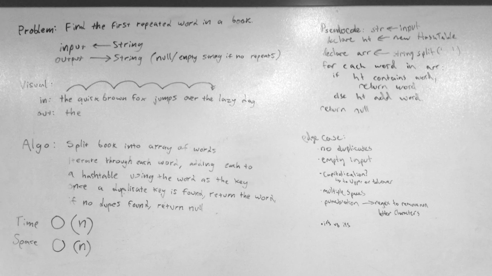

# First Repeated Word
A C# algorithm challenge implementation.

## Challenge
Given a string, find and return the first repeated word in the string.

## Approach & Efficiency
First, the string is split on spaces to create an array of words.
Next, the array of words is iterated through, each word being added to a hashtable using the word as the key.
Once a repeated word is found, the word is returned. If no repeat words are found, null is returned.

### Big O
**Time**: O(n)
- Because this solution checks every word in the string once, the time the algorithm takes to complete scales linearly with the number of words in the string.

**Space**: O(n)
- Because this solution splits the string into an array of words, and then (if no repeats are found) stores each word again in a hashtable, the space taken by the algorithm scales linearly with the number of words in the string.

## Solution
