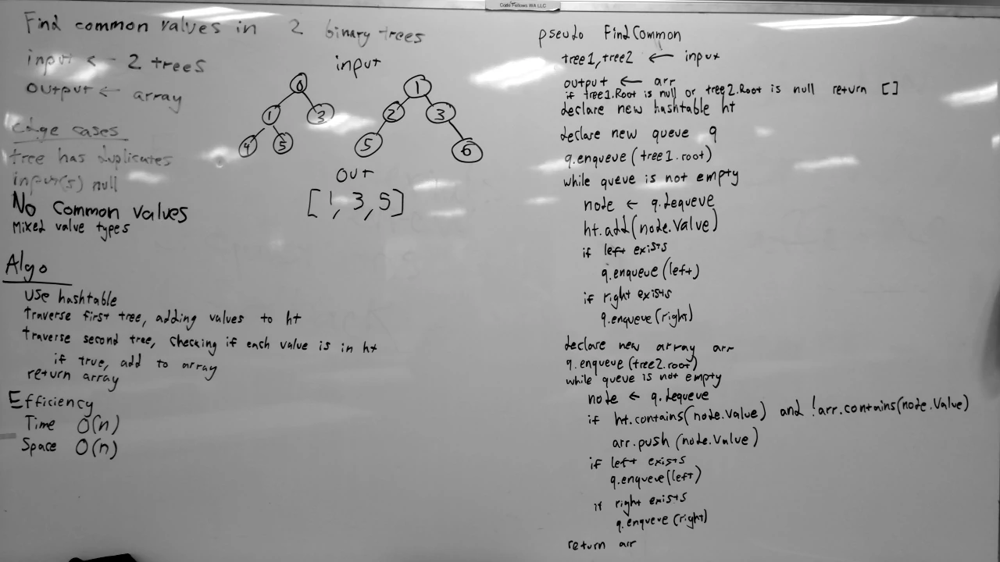

# Tree Intersection
A C# algorithm challenge implementation.

## Challenge
Write a function that takes in two binary trees as arguments, and returns a collection of values found in both trees.

## Approach & Efficiency
First, the first input tree is iterated through, and each of the values stored within are copied to a hashtable.
Next, the second input tree is iterated through, checking if each node value is already stored within the hashtable, and added to the output list if so.
Finally, the resulting list is returned.

### Big O
- **Time**: O(n)
  - This solution traverses both trees, accessing each node exactly once. Therefore, because this algorithm uses a hashtable to store and find values of the trees (operations that have an O(1) time complexity), the time taken by this algorithm scales linearly with the number of nodes in the input trees.
- **Space**: O(n)
  - This solution creates a new hashtable and creates a new list, and the size of each of these data structures is determined by the number of nodes in the first tree, and the number of matching values in the second tree, respectively. Therefore, the amount of memory used by this algorithm scales (approximately) linearly with the number of nodes in the input trees.

## Solution
