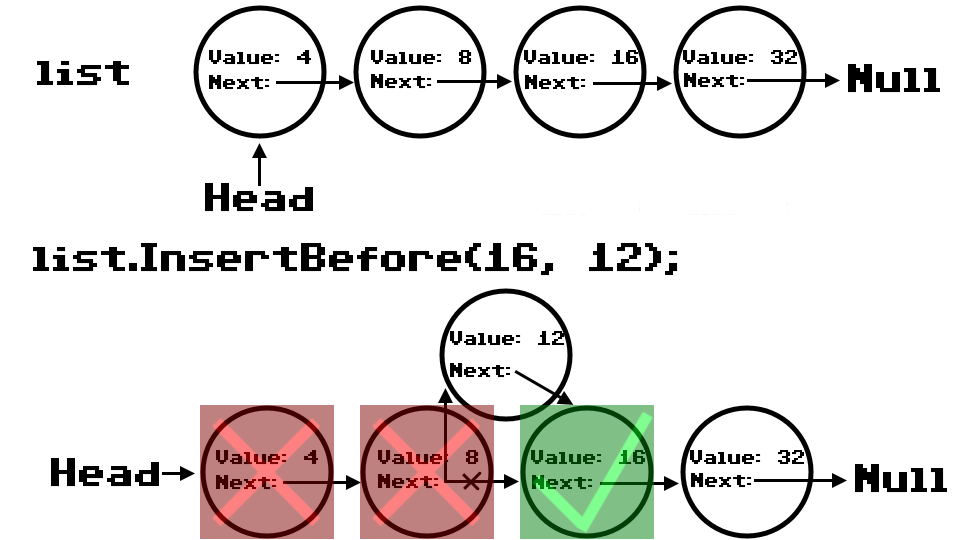
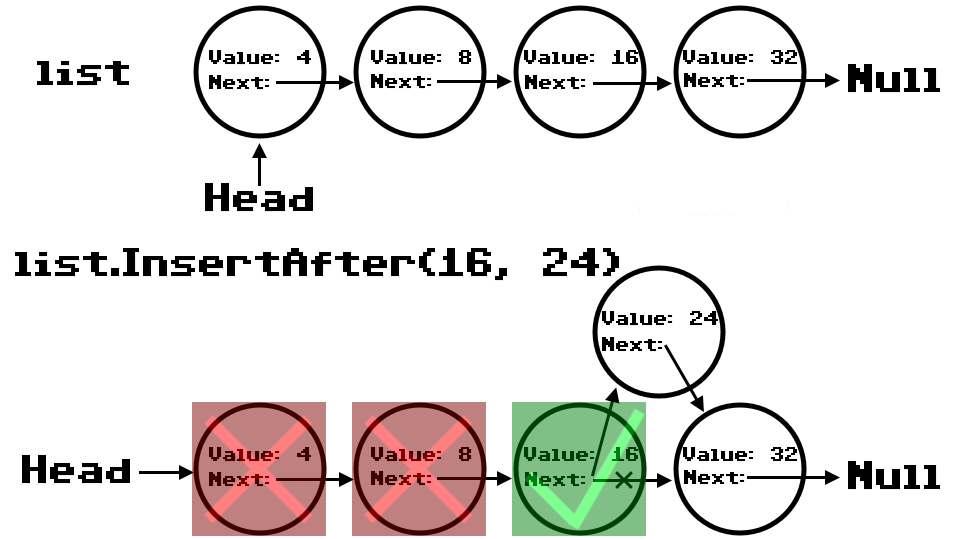

# Singly Linked List
**Author**: Benjamin Taylor

## Description
A C# implementation of a singly-linked list. A singly linked list is comprised of data objects called "nodes" that contain a value and a pointer to the next node in the list. The list object itself only contains a reference to the first node in the list, and the methods required to traverse the list. The methods of this linked list are *Insert*, *Includes*, *Print*, *Append*, *InsertBefore*, *InsertAfter*, and *KthFromEnd*.

## Methods
| Method | Summary | Big O Time | Big O Space | Example |
| :----: | :-----: | :--------: | :---------: | :-----: |
| Insert | Adds a node to the front of the linked list | O(1) | O(1) | list.Insert(256) |
| Includes | Checks if the list includes a given value and returns a boolean depending on the result | O(n) | O(1) | list.includes(127) |
| Print | Formats the linked list as a string | O(n) | O(1) | list.Print() |
| Append | Adds a node to the back of the linked list | O(n) | O(1) | list.Append(42) |
| InsertBefore | Adds a node to the list before the first node in the list that has a value that matches the given target value | O(n) | O(1) | list.InsertBefore(256, 255) |
| InsertAfter | Adds a node to the list after the first node in the list that has a value that matches the given target value | O(n) | O(1) | list.InsertAfter(256, 257) |
| KthFromEnd | Gets the value of the node that is k nodes away from the end of the list | O(n) | O(1) | list.KthFromEnd(1) |

## Visuals

### Insert Method
**Creates a new node with a given value, assigns the current Head of the linked list as its Next, and then re-assigns the Head of the list to be the new node.**

### Includes Method
**Iterates through the list, comparing a given value to each nodes value until the values match or the end of the list is reached. If the value is found, the method returns true. If the value is not found, the method returns false.**

### Print Method
**Formats the linked list as a string.**

### Append Method
**Adds a node to the back of the linked list**

### InsertBefore Method
**Adds a node to the list before the first node in the list that has a value that matches the given target value**

### InsertAfter Method
**Adds a node to the list before the first node in the list that has a value that matches the given target value**

### KthFromEnd Method
**Gets the value of the node that is k nodes away from the end of the list**

