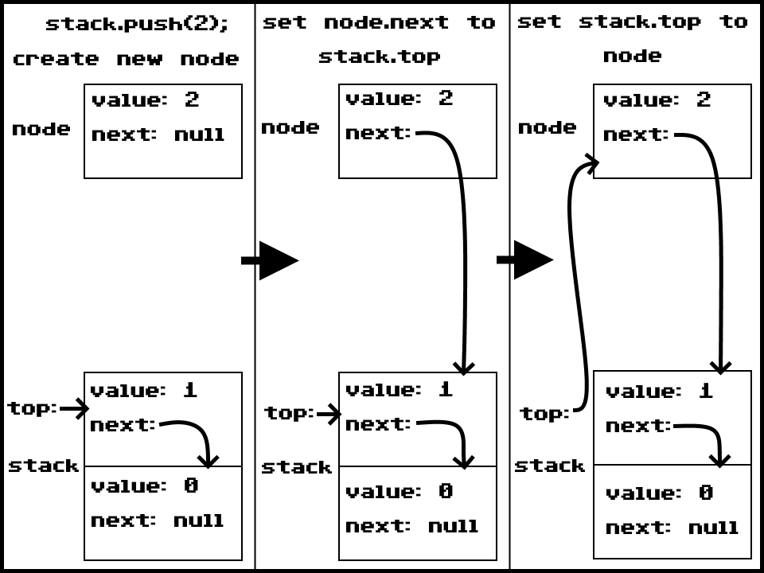
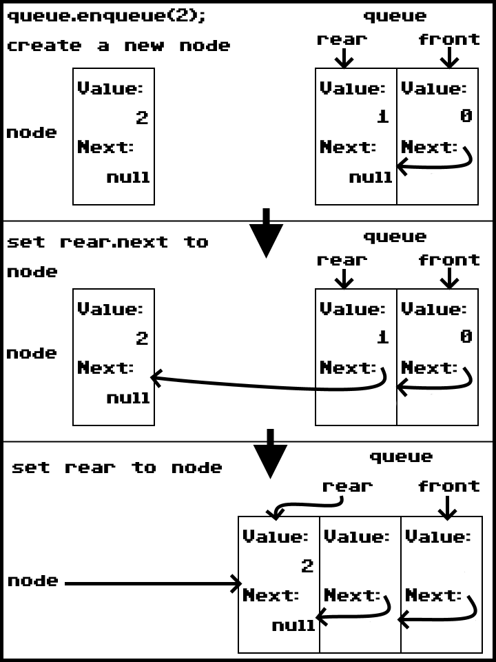
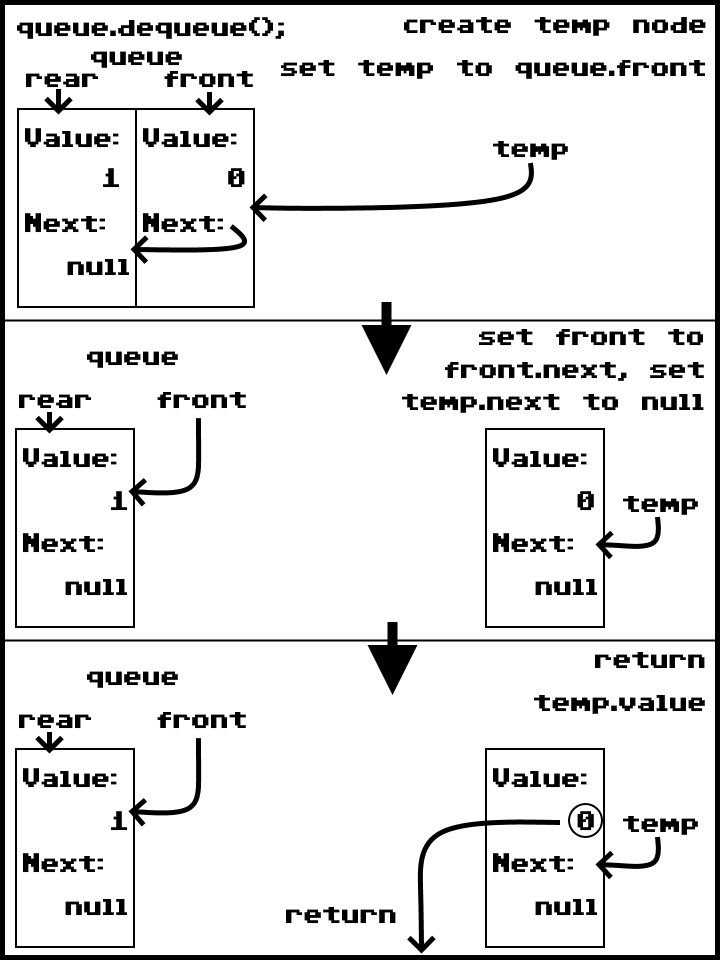

# Stack & Queue
**Author**: Benjamin Taylor

## Description
A C# implementation of the **stack** and **queue** data structures. 
Both data structures are similar to a linked list in that they are made up of individual **node** objects. They differ, however, in how the nodes are accessed.  
A stack operates on a first in, last out basis. When a node is added, it is placed at the **top** of the stack, and when a node is removed, it is taken from the top of the stack.  
A queue operates on a first in, first out basis. When a node is added, it is placed at the **rear** of the queue, and when a node is removed, it is taken from the **front** of the queue.

## Stack Methods
| Method | Summary | Big O Time | Big O Space | Example |
| :----: | :-----: | :--------: | :---------: | :-----: |
| Push | Places a new node at the top of the stack. | O(1) | O(1) | `stack.Push(1)`
| Pop | Removes a node from the top of the stack. | O(1) | O(1) | `stack.Pop()`
| Peek | Retrieves the top nodes value. | O(1) | O(1) | `stack.Peek()`

## Stack Visuals
### Push
  
First, a new node is created. Then, this new nodes next is set to the top node. Finally, the top node is set to the new node.

### Pop
  
First, a temporary node is created and set to the top node. Next, The top node is set to the top nodes next. Finally, the value of the temporary node is returned.

### Peek
Returns the top nodes value.

## Queue Methods
| Method | Summary | Big O Time | Big O Space | Example |
| :----: | :-----: | :--------: | :---------: | :-----: |
| Enqueue | Places a new node at the rear of the queue. | O(1) | O(1) | `queue.Enqueue("cat")`
| Dequeue | Removes a node from the front of the queue | O(1) | O(1) | `queue.Dequeue()`
| Peek | Retrieves the front nodes value. | O(1) | O(1) | `queue.Peek()`

## Queue Visuals
### Enqueue
  
First, a new node is created. Then, the rear node's next is set to the new node. Finally, the rear is set to the new node.

### Dequeue
  
First, a temporary node is created and set to the front node. Next, the front node is set to the front nodes next. Finally, the temporary nodes value is returned.

### Peek
Returns the front nodes value.
